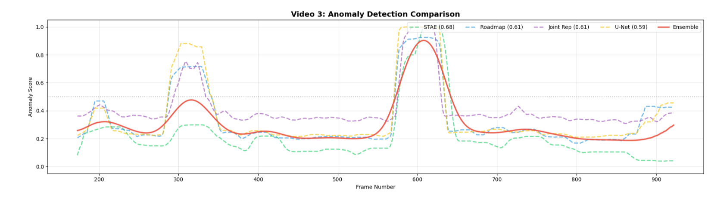

# VLG Pixel Play: Video Anomaly Detection 🎥🚨


**Name:** Harshit Agrawal

**Enrollment No.:** 25125017

**Branch:** Btech DSAI

**Year:** 1st

## 📌 Project Overview
This project was developed for the **VLG Pixel Play** competition. The goal is to develop a robust computer vision model capable of detecting **anomalous events** in surveillance footage.

In a real-world environment, the challenge is to distinguish between standard background activities (crowds, traffic) and significant deviations (accidents, violence, unusual objects). The model is trained on **unlabeled normal activities** and tested on a dataset containing both normal and anomalous events.

### 🏆 Achievement
**Final Score: 72% Average Precision (AP)** achieved using a custom **Quad-Model Ensemble** technique.

---

## 🏗️ Model Architecture: The Quad-Model Ensemble
Instead of relying on a single architecture, this solution combines four distinct approaches to maximize robust detection:

1.  **STAE (Spatio-Temporal Autoencoder):** Captures temporal motion and spatial features simultaneously to detect deviations in movement patterns.
2.  **Roadmap (Lite):** A modified, efficient version of the ROADMAP architecture, a multipath ConvGRU-based frame prediction network.
3.  **U-Net Reconstructor:** A high-fidelity reconstruction network. High reconstruction error = Anomaly.
4.  **Joint Representation:** A specialized GAN model focusing on learning the joint distribution of appearance (spatial) and motion (temporal) features.

The final output is generated by an **Ensemble Voting Script** that weighs the probability scores from all four models.

  
---

## 📂 Repository Structure
The repository is organized to separate production-ready code from research experiments:

```text
├── Final_codes/             # ✅ MAIN SUBMISSION CODE
│   ├── Enssemble_code/      # Scripts to combine model outputs
│   ├── Final_models/        # Weight Files for the 4 best models
│   └── training_notebooks   # Notebooks used for training and testing the final models
│
├── experimental/            # 🧪 Research & Archives
│   ├── models/              # Alternative architectures tested
│   ├── notebooks/           # Experimental training runs
│   └── submissions/         # Intermediate CSV outputs
│
├── visuals/                 # 📊 Graphs, Loss Curves, and Architecture Diagrams
│
|-- submission_quad_essemble.csv #The final submission file
├── requirements.txt         # Dependencies
└── README.md                # Project Documentation
```
🚀 Installation & Usage (Kaggle Workflow)

This repository is designed to be fully reproducible within a Kaggle Notebook environment. 

Step 1: Environment Setup

Clone this repository into the working directory:
```
!git clone https://github.com/harshit-iitr/VLG_Pixel_play
```

Step 2: Install Dependencies

Navigate to the cloned folder and install the required libraries:
```
%cd VLG-Pixel-Play-VAD
!pip install -r requirements.txt
```
Step 3: Running Final Notebooks
  1. All Notebooks are well commented and dubbuged and tested to work on cloned environment.
  2. Import the required notebook with Pixel Play database on Kaggle.
  3. If you want to train the model (could take 2-10 hrs), then change the model path in notebook testing cell.
  4. Else use pretrained weights during testing.
  5. Save the final submission file outputs (submission_boosted_{model name}) and use it for next step

Step 4: Reproducing the Result

To generate the final 72% AP submission:

Generate Individual Scores: Run the notebooks in Final_codes/Final_models/ to generate the prediction CSV for each of the 4 models.
Else use the already generated files by just running essemble code:

Run the Enssemble:
```
%cd Final_Codes/Essemble Script
!python Enssemble Script.py
```

Output: The script will produce submission_quad_essemble.csv in the current directory.

📊 Visuals

Detailed performance graphs and some denoised/noisy videos can be found in the visuals/ directory.


